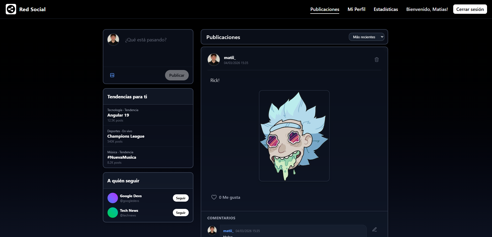
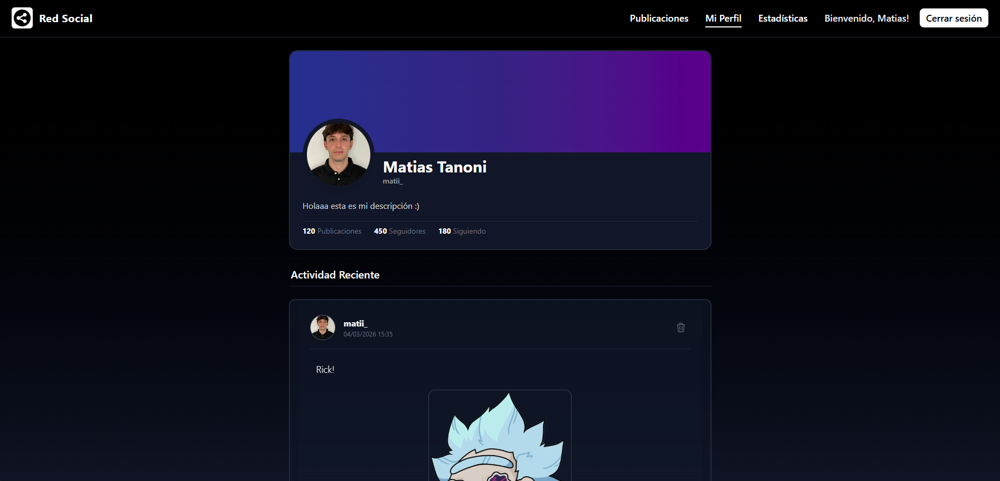
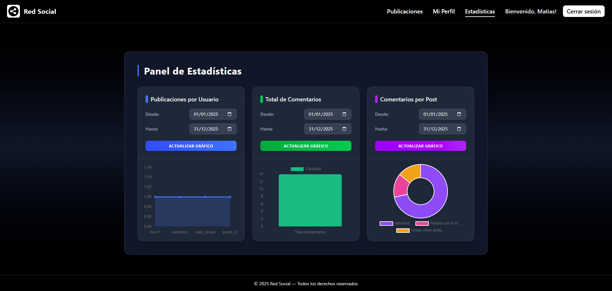

# 🚀 Red Social

<p align="center">
  
  
  
  
</p>

> Una plataforma social moderna, interactiva y escalable diseñada para conectar usuarios y compartir contenido en tiempo real.

---

## 📖 Descripción

PROYECTO DE PROGRAMACIÓN 4 | SEGUNDO PARCIAL | UTN

Este proyecto es una **Red Social Completa** (Full Stack) que permite a los usuarios registrarse, crear publicaciones, interactuar mediante likes/comentarios y gestionar su perfil. Además, cuenta con un panel administrativo robusto para la visualización de métricas clave.

El enfoque principal del desarrollo ha sido la experiencia de usuario (UX), implementando un diseño **Dark Mode** limpio y estético, y una arquitectura de software sólida utilizando **Angular** en el frontend y **NestJS** en el backend.

---

## 📸 Vistas principales de la aplicación

*📰 Publicaciones*



Pantalla principal donde los usuarios pueden crear, visualizar e interactuar con publicaciones.
Crear nuevos posts
Dar like y comentar
Feed dinámico en tiempo real
Diseño responsive


*👤 Perfil de Usuario*



Sección donde cada usuario puede gestionar su información y ver su actividad.
Foto de perfil editable
Bio personalizada
Listado de publicaciones propias
Contador de seguidores / seguidos

*📊 Estadísticas*



Panel analítico con métricas de interacción del usuario.
Total de publicaciones
Cantidad de likes recibidos
Seguidores ganados
Gráficos de crecimiento

## ✨ Características Principales

### 👤 Usuarios & Autenticación
* **Registro e Inicio de Sesión:** Sistema seguro con validaciones en tiempo real.
* **Perfiles de Usuario:** Personalización de perfil y visualización de actividad.

### 📲 Feed & Interacciones
* **Publicaciones:** Creación y visualización de posts con diseño asimétrico y moderno.
* **Sistema de Likes:** Interacción fluida y animada.
* **Comentarios:** Hilos de conversación en las publicaciones.
* **Navegación:** Paginación optimizada (Cargar más / Anterior y Siguiente).

### 🛡️ Panel de Administración (Dashboard)
* **Estadísticas Visuales:** Gráficos y métricas sobre el uso de la plataforma.
* **Gestión de Contenido:** Herramientas para moderar publicaciones.
* **UI Stats:** Diseño minimalista (Dark Theme) para la visualización de datos.

---

## 🛠️ Stack Tecnológico

| Área | Tecnología | Uso Principal |
| :--- | :--- | :--- |
| **Frontend** | Angular 17+ | Estructura de componentes y lógica de cliente. |
| **Estilos** | Tailwind CSS | Diseño responsivo y sistema de temas (Dark Mode). |
| **Backend** | NestJS | API RESTful, lógica de negocio y seguridad. |
| **Lenguaje** | TypeScript | Tipado estático para todo el proyecto. |
| **Base de Datos** | MongoDB | Persistencia de datos. |

---

## 🚀 Instalación y Despliegue

Sigue estos pasos para correr el proyecto localmente.

### Prerrequisitos
* Node.js (v18 o superior)
* NPM o Yarn

### 1. Clonar el repositorio
```bash
git clone [https://github.com/tu-usuario/nombre-repo.git](https://github.com/tu-usuario/nombre-repo.git)
cd nombre-repo
